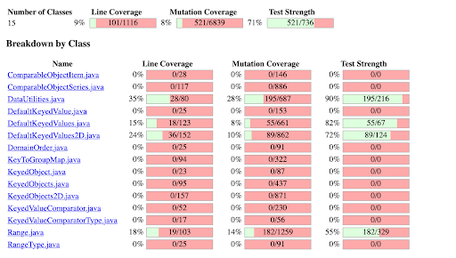
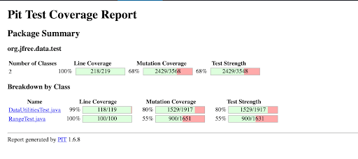
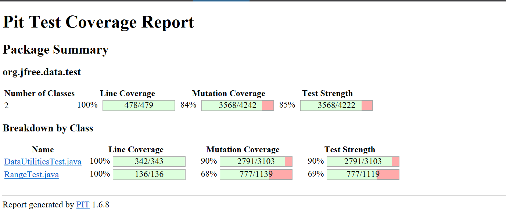
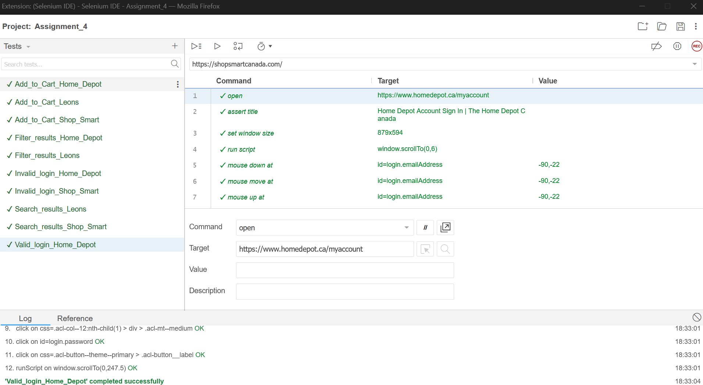

**SENG 637 - Dependability and Reliability of Software Systems**

**Lab. Report \#4 – Mutation Testing and Web app testing**

| Group \#: 12   |                  |
| -------------- | ---------------- |
| Student Names: |  Andrew Lee      |
|                |  Dillon Pullano  |
|                |  Jonathan Lui    |
|                |  Gi-E Thang      |
|                |  Yaad Sra        |

# Introduction

This report details the findings of our assignment 4 related to mutation testing and web application testing. The objective of this assignment was to gain practical experience in assessing the effectiveness of test suites with respect to mutation testing, and automating tests for web interfaces.

Part 1 delves into mutation testing. We employed Pitest to inject faults (mutations) into the code of the Range and DataUtilities classes from a previous assignment. Through analysis of the generated mutants and the effectiveness of our original test suites in detecting them, we gained valuable insights into the quality of our tests. 

Part 2 focuses on web application testing using Selenium. We selected a website (details to be specified based on chosen website) and designed automated test cases for at least two functionalities using Selenium IDE. Our test cases incorporate verification points to ensure the application behaves as expected. 

Through this assignment, we gained a deeper understanding of mutation testing as a technique to evaluate test suite effectiveness and the power of Selenium for automating web application tests.

# Analysis of 10 Mutants of the Range class 

The following section discusses 10 mutants picked at semi-random. Our intention was to select a variation of tests associated with different types of mutations and whether they were killed or had survived:

## Mutant #1: (Code Line: 90, Mutation Line: 1, Location: <Init>, Killed by: org.jfree.data.test.RangeTest)

#### Type: changed conditional boundary → KILLED
#### Actual Code: if (lower > upper) 

#### Explanation:

This type means that Pitest tried to change the code to have a different conditional boundary. Two possible examples of this modification could be “lower >= upper” or “lower > upper + 1”. Since the test was KILLED, it shows that the org.jfree.data.test.RangeTest class was able to detect the change.

## Mutant #2: ( Code Line: 95, Mutation Line: 3, Location: <init>, Killed By: None)

#### Type: Incremented (a++) double local variable number 1 → SURVIVED
#### Actual Code: this.lower = lower;

#### Explanation:
This means Pitest tried to change the code to increment (add 1) to a double local variable named "lower" using the post-increment operator (a++).
The original code and the mutated code (where "lower" is incremented by 1) produced the same output for all test cases. This is why the mutation is reported as "SURVIVED". The mutation increments "lower" by 1 using a post-increment operator (a++). This means the value of "lower" is first assigned from the argument passed to the constructor, and then incremented by 1.

## Mutant #3: ( Code Line: 95, Mutation Line: 4, Location: <Init>, Killed by: None )

#### Type: Decremented (a--) double local variable number 1 → SURVIVED
#### Actual Code: this.lower = lower;

#### Explanation:
This means Pitest tried to change the code to decrement (subtract 1) from a double local variable named "lower" using the pre-decrement operator (a--).
The mutation decrements "lower" by 1 using a pre-decrement operator (a--). This means the value of "lower" is first decremented by 1 and then assigned from the argument passed to the constructor.

## Mutant #4: ( Code Line: 123, Mutation Line: 9, Location: getLength, Killed by: org.jfree.data.test.RangeTest)

#### Type: Replaced double subtraction with multiplication → KILLED
#### Actual Code: return this.upper - this.lower;

#### Explanation: 
Pitest changed the code in the getLength method to use multiplication (*) instead of subtraction (-) between this.upper and this.lower. The original code likely calculated the length (extent) by subtracting the lower bound (this.lower) from the upper bound (this.upper). Replacing this with multiplication would produce incorrect results.

## Mutant #5: ( Code Line: 123, Mutation Line: 6, Location: getLength, Killed by: org.jfree.data.test.RangeTest  )

#### Type: Replaced double operation with first member → KILLED
#### Actual Code: return this.upper - this.lower;

#### Explanation: 
Pitest replaced the entire double operation (this.upper - this.lower) with just its first member (this.upper). In essence, the mutated code returns this.upper directly, discarding the subtraction. The org.jfree.data.test.RangeTest likely contains test cases that expect getLength to return the correct length/extent.
The mutation significantly alters the method's output, causing those test cases to fail, hence marking the mutation as "KILLED."

## Mutant #6: (Code Line: 158, Mutation Line: 1, Location: intersects, Killed by: org.jfree.data.test.RangeTest)

#### Type: replaced boolean return with false for org/jfree/data/Range::intersects → KILLED
#### Actual Code: return (b1 > this.lower);

#### Explanation:
Pitest modified this code to make it so that the conditional statement “(b1 > this.lower)” always returns a false boolean, even when the intersect should be true. Since the test was KILLED, it shows that the org.jfree.data.test.RangeTest class was able to detect the change with one of our test functions.

## Mutant #7: ( Code Line: 144 , Mutation Line: 28, Location: Contains, Killed by: org.jfree.data.test.RangeTest )

#### Type: Less than to less or equal → KILLED
#### Actual Code: return (value >= this.lower && value <= this.upper);

#### Explanation: 
Pitest changed the comparison operator in the Contains method from < (less than) to <= (less than or equal to). The original code likely checked if a value (value) was strictly greater than or equal to the lower bound (this.lower) and strictly less than or equal to the upper bound (this.upper) to determine if it was "contained" within the range.

## Mutant #8: ( Code Line: 333, Mutation Line: 13, Location: expand, Killed by: None)

#### Type: Incremented (a++) double local variable number 9 → SURVIVED
#### Actual Code: if (lower > upper) 

#### Explanation:
Pitest modified this code to make it so that the conditional statement “if (lower > upper)” is modified so that local variable 9 (likely to be either lower or upper) is incremented up be 1 before the line is executed. Since the test SURVIVED, it shows that the org.jfree.data.test.RangeTest class was not able to detect the change with one of our test functions.

## Mutant #9: ( Code Line: 387, Mutation Line: 2, Location: shiftWithNoZeroCrossing, Killed by: None)

#### Type: Substituted 0.0 with 1.0 → NO_COVERAGE
#### Actual Code: if (value > 0.0)

#### Explanation:
Pitest modified this code to make it so that the conditional statement “if (value > 0.0)” is modified to “if (value > 1.0). Since the test has NO_COVERAGE, it shows that the org.jfree.data.test.RangeTest class does not cover this function. This makes sense as our RangeTest class did not include tests for the shiftWithNoZeroCrossing Range function.

## Mutant #10: ( Code Line: 475 , Mutation Line: 13, Location: toString, Killed by:  None)

#### Type: Negated double field lower → SURVIVED
#### Actual Code: return ("Range[" + this.lower + "," + this.upper + "]");

#### Explanation: 
​​Pitest negated the value of the this.lower double field within the toString method on line 475. This likely means it changed the sign from positive to negative or vice versa. The original code and the mutated code (where this.lower is negated) produced the same output for all test cases. This is why the mutation is reported as "SURVIVED."

# Report all the statistics and the mutation score for each test class

The figure below shows the mutation coverage results for the DataUtilities and Range classes:

Looking at the figure above, the ‘DataUtilities’ class produced a mutation coverage of 28% while the ‘Range’ class produced a mutation coverage score of 14%. This is much lower than we expected.

The figure below shows the mutation coverage results for our initial DataUtilitiesTest and RangeTest test suites:

Looking at the figure above, the ‘DataUtilitiesTest’ class produced a mutation coverage of 80% while the ‘RangeTest’ class produced a mutation coverage score of 55%. This suggests that our DataUtilitiesTest suite from assignment 3 was more robust/effective and more likely to identify bugs than our RangeTest suite. It also suggests that it will be harder for us to increase the DataUtilitiesTest suite by the required 10% due to it already scoring a fairly high value.

# Analysis drawn on the effectiveness of each of the test classes

The figure below shows the mutation coverage results for our updated DataUtilitiesTest and RangeTest test suites:

Looking at the previous 2 figures above, we were able to increase our DataUtilitiesTest score by 10% and our RangeTest score by 13%.

To achieve these results, we found that the most effective method for our tests to identify previously not seen mutations was to add “final” to variables that were not to be modified after they were created. We also made sure that the compared values were cast to the same primitive “Double” so that when passed into the AssertEquals function, we did not have to specify a tolerance value. The tolerance value initially was resulting in many surviving mutations. 

For the RangeTest class, we additionally removed a single test that had all mutations surviving due to us not applying an assertEquals condition at the end. The last step to achieving these increases was to take what worked and expand on it. Most tests were written in a similar fashion for the tests that had a format that produced higher mutation coverage scores. 

# A discussion on the effect of equivalent mutants on mutation score accuracy

Equivalent Mutants Effects on Mutation Score Accuracy:

Equivalent mutants are defined as being syntactically different while producing the same semantic results. This can be simplified to say that the equivalent mutants look different but behave the same way or produce the same results. Due to this, having many equivalent mutants can give a false sense of how well a test suite performed for mutation testing. 

Let's consider an example where one line of code has 100 equivalent mutants that all pass and there are a total of 500 mutants for the whole evaluation. The other 400 mutants are split over another 20 lines of code and are distributed more or less equally with 50% pass. The accuracy score produced while omitting these equivalent mutants should be close to 50%. However, when they are not omitted, the accuracy score is closer to 60% coverage. For this reason it is important to be able to consider equivalent mutants and look at other methods of coverage.

Automatically Detecting Equivalent Mutants Discussion:

In order to automate the detection of equivalent mutants, we would first need to split up mutations based on the line of code that they are mutated from. We would then need to identify whether or not the change in code was syntactically different. This would be relatively easy by just comparing the lines. If they are different in appearance then they are syntactically different. 

The last (and most difficult) step would be to determine if the modified lines of code were semantically different. This last part is tricky because we would need to have an interpreter program that could extract meaning out of the lines of code and compare them. It might be easier to write a program for more simple cases such as the one from the course notes where (i<10) and (i!=10) are equivalent, but it would be more complex to evaluate semantics on more complex lines of code. 

# A discussion of what could have been done to improve the mutation score of the test suites (Design Strategy)

To improve the mutation score of the test suites, we focused on enhancing test coverage and code path effectiveness. Our process focused on refining existing tests to increase the mutation coverages rather than introduce a larger number of tests. The overall process is as follows:

We first identified the lines of code that were producing the most amount of mutations that had survived (i.e. low coverage areas). We figured that by starting with the low hanging fruit, we could establish what was occurring in that test and then adapt the found solutions into our other lines of code that were producing similar results from similar mutations.

When we were first playing around with these, we tried to add additional assertEquals conditions to catch more of the edge cases. However, we noticed that for each line we added, that was just another set of mutations that would produce surviving mutations as well. Therefore, the problem had to do with a lack of imposed data restrictions on how these assertEquals were being executed, and not necessarily how they covered boundary and edge cases. 

As mentioned previously above, we found that the most effective method for our tests to identify previously not seen mutations was to add “final” to variables that were not to be modified after they were created. We also made sure that the compared values were cast to the same primitive “Double” so that when passed into the AssertEquals function, we did not have to specify a tolerance value.

Using the above mentioned processes, we iteratively reviewed and updated our test suites until we had increased mutation coverages past the 10% gain threshold for both the DataUtilitiesTest and RangeTest test suites.

# Why do we need mutation testing? Advantages and disadvantages of mutation testing

We need mutation testing because it systematically assesses the quality of our test suite by introducing small changes (mutations) to the codebase and checking if the tests can detect these changes. It helps improve test case quality and identifies defects missed by other testing methods. The main advantages and disadvantages that we have identified are as follows:

Advantages:

Further evaluates test suite effectiveness from our previous assignments.
Improves test case quality.
Identifies defects that might have been missed by other testing methods.

Disadvantages:

Computational complexity (Takes about 10-15 minutes to run through one iteration).
High false positives (Many of our initial mutants survived).
Manual result analysis required and limited tool support (No semantics programs to help identify equivalents as mentioned above).

# Explain your SELENUIM test case design process

We set up a single Selenium test project that consisted of 2 tests from each group member, totalling 10 tests. The raw code file can be found in the github with this submission and is labelled as “Assignment_4.side”. The successful results from these tests can be seen in the Figure below:

Our Selenium test case design process involved several key steps, which followed closely to the link provided in the assignment handout. A single project was created on one of our group members' computers. We then added our 2 tests by screen sharing and letting the other group members take control while the rest of us watched and provided input.

We decided to create tests using the “Home Depot”, “Leons”, and “Shop Smart” home pages. We wanted to focus on basic functionalities for these sites such as logging into the websites with valid and invalid credentials, filtering through search results, and adding items to our carts.

Our tests included the loading of specific pages, resizing of web pages, scrolling, clicking, and typing. We only applied basic “Assert” commands to use as a type of checkpoint for confirming/verifying that a page had loaded properly after a critical command had been run. This was done through right clicking when the page had loaded correctly, and navigating to the assert Selenium extension command.

Tests were initially created through the Firefox Selenium extension by adding a new test to our suite, typing in the page start point, and then selecting the record button. There were a few tests that worked initially and then failed when we tried to re-run them. We found that tests were failing for one of 2 reasons. 

The most common failure was coming from the fact that some of the tests had a lack of assertions. Most errors disappeared when assertions were added in to confirm that a page had loaded in correctly and that a clickable object actually existed on the page. One of the tests initially failed because the item that was initially clicked was not one that appeared every time, but rather a random placement of an item that could be purchased. This error was fixed by navigating to the selectable items following a different path. 

# Explain the use of assertions and checkpoints

Assertions/checkpoints are components of Selenium test scripts that are used for validation and verification purposes. Based on the references provided to us in this assignment handout (https://www.guru99.com/first-selenium-test-script.html), an assertion is a command that verifies if a certain condition is met. It can either be an “Assert”, “Verify”, or “WaitFor”. 

While similar in nature, there are minor distinctions between them according to (https://www.guru99.com/first-selenium-test-script.html). An “Assert” will stop the execution of a test when the assertion fails, compared to a “Verify” command that will log the failure, but continue with the test. The “WaitFor” command waits for a specific condition to be met before continuing on to the rest of the test.

As discussed in the sections above, we mainly used “Assert” commands in our tests to verify that each page had loaded in correctly after a process was completed or a click was applied. Initially, some of our tests were failing without these but after adding them in were able to be repeated successfully.

# how did you test each functionaity with different test data

As mentioned above, the functionalities that we decided to test for were logging into the websites with valid and invalid credentials, filtering through search results, and adding items to our carts. The test data was based on the structure of the 3 websites (i.e. Home Depot, Leons, and Shop Smart) and each functionality was tested as follows:

Login functionality was tested through the Home Depot and Shop Smart web pages. Home Depot had 1 test for valid and 1 test for invalid login credentials while Shop Smart had 1 test for invalid login credentials. Adding items to our cart functionality was tested through 1 test each for the Home Depot, Leons and Shop Smart web pages. 

Filtering through search results and typing in search results functionality was tested through Home Depot, Leons, and Shop Smart web pages. Home Depot only had 1 test for filtering results. Leons had 1 test for filtering results and 1 test for searching results while Shop Smart only had 1 test for searching results.

# How the team work/effort was divided and managed

The team's work was divided and managed collaboratively:

We decided to initially divide up the tasks based on individual strengths and areas of interest. Jonathan focused on setting up the Selenium Firefox extension test scripts for the Home Depot, Leons, and Shop Smart websites, while other team members contributed to the initial mutation tests and analysis. We all worked on the report as things progressed. 

As mentioned above, a single Selenium project was created on Jonathan’s computer. We each added our 2 tests by screen sharing and letting the other group members take control while the rest of us watched and provided input.

We maintained regular communication throughout the completion of this assignment over Discord to share progress updates, discuss challenges, and coordinate efforts effectively. This ensured that everyone stayed aligned with the project goals and timelines, while allowing us to reach out for help with certain tasks when needed. We conducted peer reviews of the test scripts to ensure quality and consistency. Each team member provided feedback and suggestions for improvements.

# Difficulties encountered, challenges overcome, and lessons learned

During the assignment, we encountered several difficulties and challenges:

Some team members faced initial challenges in getting acquainted with the Selenium IDE and its features. We also found that it was initially hard to debug the tests we had created when some of them didn’t work. Using the references provided in the assignment handout helped us develop our skills with this tool through iteration. 

There was a huge learning curve when it came to increasing coverage for the DataUtilitiesTest and RangeTest suites. What worked in some scenarios, made others worse and it was only through trial and error that we were able to eventually get higher coverage results. When one of us had a breakthrough, it was shared with the group to expand this to the rest of our results.

Overall, these challenges provided valuable learning experiences, and we emerged with better skills working with the Selenium IDE and increasing mutation coverage for our existing test suites. Working as a group had the benefits of being able to brainstorm to find better solutions when one of us was stuck.

# Comments/feedback on the assignment itself

The assignment provided a great opportunity to gain practical experience with mutation testing and web application testing using Pitest and Selenium, respectively. The exercises in this assignment allowed us to apply theoretical concepts learned in class and deepen our understanding of software testing principles and techniques.

However, we found that the assignment instructions could be more detailed and structured, especially regarding the setup and configuration of testing tools. Providing clearer guidelines and step-by-step instructions would help streamline the implementation of the assignment and could reduce confusion among students in the future.

Overall, we appreciated the opportunity to complete this assignment and look forward to applying our newfound knowledge and skills in future projects.

